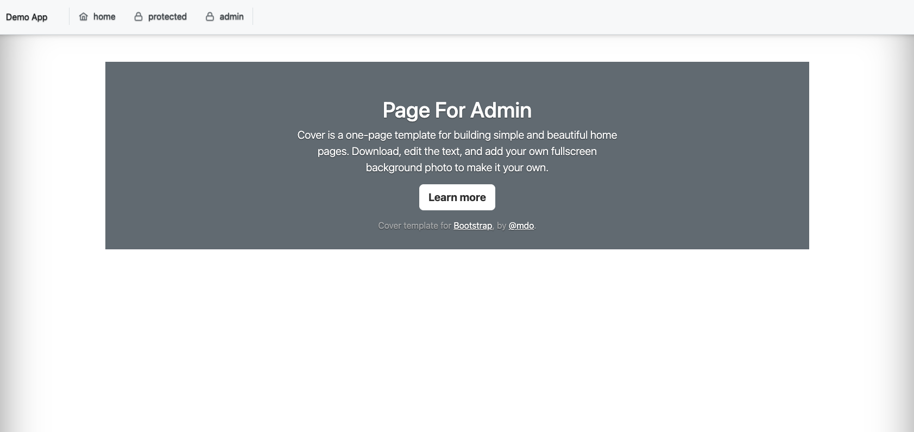

# Jakarta Security Demo App

## 概要
Jakarta Securityを使って、特定のユーザーにのみページのアクセスを許可するデモアプリ
1. mainブランチ  
    認証なし
2. basicブランチ  
    BASIC認証を実装
3. custom-formブランチ  
    FORM認証を実装

詳細はプルリクエストを参照

## 画面一覧
- ユーザー作成・一覧

- 登録ユーザー専用ページ

- 管理ユーザー専用ページ


## 起動方法
### Docker
dockerを使うと、コマンド1つで起動する
1. アプリの起動
```
docker-compose up
```
2. アクセス
`localhost:8085/demo-app`でアプリに  
`localhost:9995`で管理コンソールにアクセス  
`psql -h localhost -p 5435 -d postgres -U user`でPostgreSQLにアクセスできる(パスワードはpassword)

### maven
開発中はDocker上で起動するとコーディングが面倒なので、ホストOS上で起動
1. Java 17, maven, PostgreSQLのインストール
PostgreSQLはポート5432で起動
Wildflyをインストールし起動しておく

2. アプリの起動
```
mvn wildfly:deploy
```

3. アクセス
`localhost:8080/demo-app`でアプリに
`localhost:9990`で管理コンソールにアクセス